# The Periodic Archiving Daemon - An AIO Data Donation Solution

The Periodic Archiving Daemon is a software research solution that has been developed by members of the Australian Internet Observatory. The solution empowers citizen scientists to donate data about their web experiences, to promote research projects that utilize archives of web content in their data.

The central part of the solution takes the form of a web browser plugin - the plugin periodically 'wakes up' and accesses web pages while you go about your usual web experience. It then submits web archive data to a cloud-based database, where it can then be managed and interpreted by relevant researchers.

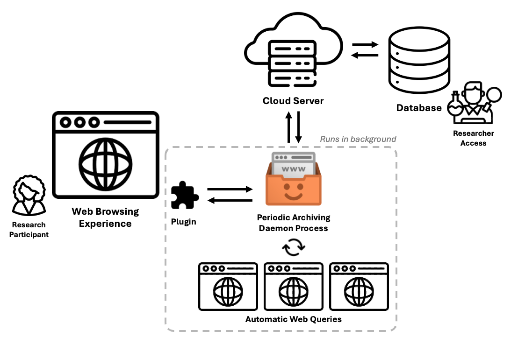

___This online guide has been designed to make usage of the Periodic Archiving Daemon streamlined and intuitive, so that it may be easily white-labelled and adapted to various research contexts.___

 Some of the key advantages of this approach, which are elaborated throughout this guide are summarised below:

📦 Adapted to **Chromium Manifest** version 2 *and* 3, for publication to a variety of Browser Extension Stores, such as:

* [The Chrome Web Store](https://chromewebstore.google.com/)
* [Microsoft Edge Add-Ons](https://microsoftedge.microsoft.com/addons/Microsoft-Edge-Extensions-Home)
* [Firefox Browser Add-Ons](https://addons.mozilla.org/en-US/firefox/)

⏩ To avoid review turn-arounds with browser extension stores, scraper functionality is designed to instead update in real-time.

🎛️ Designed to run as a 'daemon process' and optimized to create minimal disturbance to regular web-browsing experience.

🎭 Can spoof different kinds of user agents, allowing for wider data capture possibilities.

🦾 Comes with a variety of scraper functionalities and configurations.

🏷️ Easily customized and white-labelled, for fast-tracked adoption to different research projects.

As with any research project, the Periodic Archiving Daemon requires set up from both a researcher and participant perspective. Feel free to visit the **Setting Up A New Project: For Researchers** section to begin.

## Background & Past Research

The project follows on from the work of past initiatives that have pioneered data donation in participants' online web experiences - these include:

* **The AlgorithmWatch Datenspende Plugin:** The original version of the data donation project took place in Germany during the 2017 Federal election. The project was the first of its kind, demonstrating that public collaboration can reveal how algorithms shape information access without needing access to proprietary systems. 

  [Krafft, T. D., Gamer, M., Laessing, M., & Zweig, K. A. (2017). Filterblase geplatzt? Kaum Raum für Personalisierung bei Google-Suchen zur Bundestagswahl 2017. Online. Publisher: Unpublished.](https://algorithmwatch.org/de/filterblase-geplatzt-kaum-raum-fuer-personalisierung-bei-google-suchen-zur-bundestagswahl-2017/)

* **The ADM+S Australian Search Experience:** In 2021, this project extended the work of the AlgorithWatch Datenspende plugin, by adapting the software for the purpose of investigating search engine recommendations across diverse topics, and initiating a data donation project entitled the ‘Australian Search Experience’. 

  [Bruns, A. (2022). Australian search experience project: background paper.](https://apo.org.au/node/316976)

  [Australian Search Experience Web-page](https://www.admscentre.org.au/australian-search-experience/)

## Setting Up A New Project: For Researchers

### Getting Started

Thank you for choosing to use the Periodic Archiving Daemon as part of your research project.

To successfully apply this research solution, you'll need to undertake a number of crucial steps, ordered as follows:

1. White-labelling the Software
2. Designing the Scraper Functionality
3. Configuring Plugin Parameters
4. Specifying Demographic Data Collection
5. Submitting the Plugin to Browser Stores
6. Reviewing Results
7. Maintenance & Debugging

It is necessary that you read the sections for each of these steps to ensure that you take full advantage of the research solution's capabilities.

In undertaking this process, we strongly encourage you to fork this repository on your local machine, and submit all modifications therein. That way, you'll be able to take advantage of software improvements that the AIO team might deliver down the track.

## White-Labelling the Browser Plugin

White-labelling the software will be necessary to distinguish your own research project's version of the Periodic Archiving Daemon.

***Note:** Presently, the project uses a simple string-replacement script, such that strings need to only be edited in one place. These are arranged in a JSON format, found at the project's [config.json](https://github.com/Australian-Internet-Observatory/aio-periodic-archiving-daemon/blob/master/plugin/config.json) and the [Node JS package.json](https://github.com/Australian-Internet-Observatory/aio-periodic-archiving-daemon/blob/master/plugin/package.json). Throughout this and other sections, details will be given on which strings to edit in order to reflect changes across the project.*

### Branding

#### Plugin Icons

For browser-based plugins, general conventions encourage a 'square-like' PNG icon that can display aesthetically on both light and dark backgrounds (see [here](https://developer.chrome.com/docs/webstore/images#icons)).


***Note:** We've supplied our own icon for demonstration, however you'll need to adjust this to reflect your own research project's brand.*

There are two locations that house icons for the plugin:

1. **In-Browser Plugin Icons:** These will show in the Extensions tab, the Extension panel, and in other native UI elements of the browser.

   `https://github.com/Australian-Internet-Observatory/aio-periodic-archiving-daemon/tree/master/plugin/src/icons`

2. **Website Plugin Icons:** These will display (as like website favicons) for the front-facing browser pages that are included in the research participant's experience of the plugin.

   `https://github.com/Australian-Internet-Observatory/aio-periodic-archiving-daemon/tree/master/plugin/src/resources/branding/favicon`

#### Plugin Description, Management, & Locales

##### Plugin Description & Management

Editing the plugin name and description (as well as other general strings) is detailed here.

These strings are described below:

`config.json → manifest → common → name`<br>
_The name of the plugin._

`config.json → manifest → common → action → default_title`<br>
_The default title of the plugin._

`config.json → manifest → common → version`<br>
_The version of the plugin._

`config.json → manifest → common → description`<br>
_The description of the plugin._

`config.json → manifest → common → default_locale`<br>
_The default locale to use when executing the plugin._

The next set of strings relate to the packaging of the plugin - as the plugin is a Node JS project, they follow the general conventions of the applicable set-up:

`package.json → name`<br>
_The name of the Node JS project._

`package.json → version`<br>
_The version of the Node JS project._

`package.json → description`<br>
_The description of the Node JS project._

`package.json → repository → type`<br>
_The type of SVN solution used for the repository._

`package.json → repository → url`<br>
_The URL of the repository used for SVN of the project._

`package.json → author`<br>
_The author(s) of the plugin._

`package.json → bugs → url`<br>
_The URL to which bugs can be submitted for maintenance of the project._

`package.json → homepage`<br>
_The homepage of the project._

##### Locales

Locale strings are typically integrated with browser plugins to make the support of various languages seamless. While our plugin's design does not yet support the delivery of a single browser plugin codebase that supports multiple languages, we do however support configuration for a single language. Definitions of the strings that are shown to the participant are distributed between this section and the Front-Facing Pages. Below, we highlight some of the locale strings that can be edited in the aforementioned configuration JSON files.

`config.json → _locales → en → appName → message`<br>
_The application name of the browser plugin._

`config.json → _locales → en → appName → description`<br>
_The description of the application name of the browser plugin._

`config.json → _locales → en → appDescription → message`<br>
_The application description of the browser plugin._

`config.json → _locales → en → appDescription → description`<br>
_The description of the application description of the browser plugin._

`config.json → _locales → en → btnTooltip → message`<br>
_The tooltip of the browser plugin._

`config.json → _locales → en → btnTooltip → description`<br>
_The description of the tooltip of the browser plugin._

#### Front-Facing Pages

The front-facing pages of the plugin refer to the webpages that are accessible through the plugin alone, and that make up the general participant flow for operating its software functionality. As the pages are designed for in-browser access, configuration of these pages occurs through standard web design practises. All pages included in the plugin are detailed [here](https://github.com/Australian-Internet-Observatory/aio-periodic-archiving-daemon/tree/master/plugin/src/pages), and are summarized further down this section.

##### Web Design

The front-facing pages of the plugin rely on web-design editing conventions, and so can be easily edited to suit your own design preferences. In our own version, we provide a basic layout that can be easily customized to help you quickly distribution your own version of the plugin, as well as demonstrate the automatic compilation factors that will also make the process of configuring the plugin easier. Resources can be added or removed in the [branding](https://github.com/Australian-Internet-Observatory/aio-periodic-archiving-daemon/tree/master/plugin/src/resources/branding) directory. Furthermore, some common strings used across the various web pages are given here, and have been integrated into common UI designs to fast-track re-design of the plugin:

`config.json → strings → commonMappings → LANGUAGE`<br>
_The HTML language setting of the page._

`config.json → strings → commonMappings → PLUGIN_FORMAL_NAME`<br>
_The formal name of the plugin, as it would display in a browser._

`config.json → strings → commonMappings → URL_BRANDING`<br>
_The URL of the research project administering the plugin._

`config.json → strings → commonMappings → INSTITUTIONAL_LOGO_FILE`<br>
_The institutional logo to feature on the plugin._

`config.json → strings → commonMappings → INSTITUTIONAL_LOGO_FILE_BW_TRANSPARENT`<br>
_A secondary 'black-and-white' version of the institutional logo to feature on the plugin._

`config.json → strings → commonMappings → URL_LEARN_MORE`<br>
_A URL that can be visited to learn more about the plugin._

`config.json → strings → commonMappings → URL_PRIVACY_POLICY`<br>
_A URL that can be visited to read the privacy policy of the plugin._

`config.json → strings → commonMappings → FAVICON_APPLE_TOUCH`<br>
_The 'Apple Touch' metadata entry of the 'favicon' for the webpage._

`config.json → strings → commonMappings → FAVICON_16x`<br>
_The '16x' metadata entry of the 'favicon' for the webpage._

`config.json → strings → commonMappings → FAVICON_32x`<br>
_The '32x' metadata entry of the 'favicon' for the webpage._

`config.json → strings → commonMappings → FAVICON_WEBMANIFEST`<br>
_The 'web manifest' metadata entry of the 'favicon' for the webpage._

`config.json → strings → commonMappings → FAVICON`<br>
_The 'favicon' metadata entry of the 'favicon' for the webpage._

`config.json → strings → commonMappings → PAGE_AGNOSTIC_LOADING_HEADING`<br>
_The heading that appears on loading screens of the plugin._

`config.json → strings → commonMappings → METADATA_PAGE_AUTHOR`<br>
_The common author of the front-facing pages shown for the plugin._

`config.json → strings → commonMappings → METADATA_PAGE_DESCRIPTION`<br>
_The common description of the front-facing pages shown for the plugin._

***Note:** Adding new keys to the 'commonMappings' can help you customize common strings to insert across the front-facing pages. Feel free to add or remove front-facing pages within your own development specifications of the plugin, and reference your custom keys as HTML comments to have them automatically inserted across pages (e.g. such as <!--A_CUSTOM_KEY--> would be automatically replaced across files).*

##### The Participant Flow

To understand when front-facing pages are shown, it is important to understand the flow a participant takes when using the plugin. Firstly a participant installs the plugin, triggering a registration form to open. Until the participant has completed registration, they will be unable to submit data donations. Whereas upon successfully submitting the registration form, the plugin then automatically loads a page to encourage the participant to share the plugin (as is common in citizen science research projects). The plugin will then periodically open a page that displays a countdown, before officially running the archiving process. During this entire process, the participant can also access the plugin 'pop-up' window from their browser bar. Depending on the status of their plugin, it will show a relevant corresponding window - in the case that the participant is registered, they are given the option to either 'test run' or 'pause' the plugin for 24 hours. A visual representation of this flow is given below:

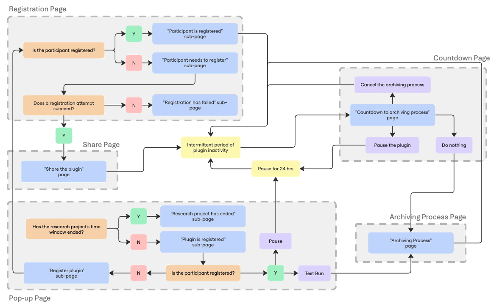

The HTML files for all front-facing pages are given [here](https://github.com/Australian-Internet-Observatory/aio-periodic-archiving-daemon/tree/master/plugin/src/pages), and are further elaborated below.

##### Registration Form

`https://github.com/Australian-Internet-Observatory/aio-periodic-archiving-daemon/blob/master/plugin/src/pages/registration.html`

The registration form has two variations that are shown - the first being that the participant is unregistered:

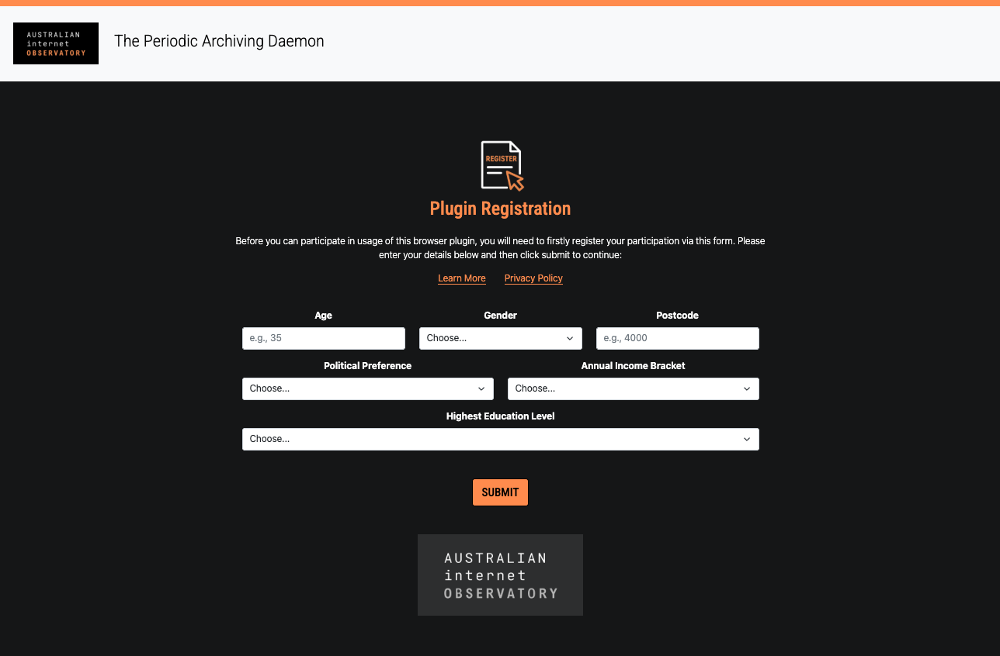

The second being that the participant is registered:


In cases such as when an internet connection is not available, the registration process (which relies on an internet connection) may fail - in this case, the following variation will be shown.

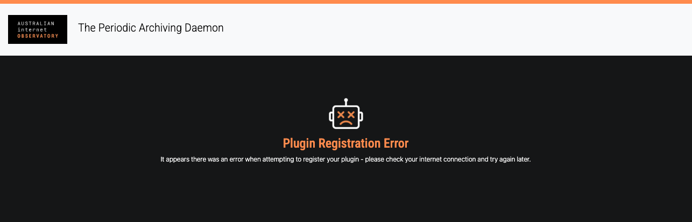

This design is configurable by the following strings:

`config.json → strings → registration.html → REGISTER_HEADING`<br>
_The heading of the registration page._

`config.json → strings → registration.html → REGISTER_LEAD`<br>
_The blurb of the registration page._

`config.json → strings → registration.html → REGISTER_PLUGIN_LOGO_FILE`<br>
_The registration imagery to show on the registration page._

`config.json → strings → registration.html → REGISTER_LEARN_MORE_TEXT`<br>
_The text that accompanies the link to the 'Learn More' page about the plugin._

`config.json → strings → registration.html → REGISTER_PRIVACY_POLICY_TEXT`<br>
_The text that accompanies the link to the 'privacy policy' page about the plugin._

`config.json → strings → registration.html → REGISTER_BUTTON_SUBMIT_TEXT`<br>
_The text that accompanies the button to submit the registration form._

`config.json → strings → registration.html → ERROR_HEADING`<br>
_The heading that displays when there is an error in the registration process._

`config.json → strings → registration.html → ERROR_LEAD`<br>
_The blurb that displays when there is an error in the registration process._

`config.json → strings → registration.html → ERROR_LOGO_FILE`<br>
_The error imagery to show on the registration page._

`config.json → strings → registration.html → REGISTERED_HEADING`<br>
_The heading that displays when registration completes successfully on the registration process._

`config.json → strings → registration.html → REGISTERED_LEAD`<br>
_The blurb that displays when the registration successfully completes on the registration process._

`config.json → strings → registration.html → REGISTERED_LOGO_FILE`<br>
_The registration completion imagery to show on the registration page._

Irrespective of whether the participant accidentally closes the registration page and then loads it up at a later stage, the page itself is dynamically designed such that it can present the correct variation to them depending on their stage of the process - this is again indicated in the participant flow.

###### Demographic Form

As part of any research project, the demographic characteristics that are captured from the participant are specific to the objectives of the research. The plugin is designed to complement this requirement by modularizing all demographic characteristics by respective HTML controls. We provide some example fields (both categorical and nominal in nature), and that are contained between the '<!-- Demographic Details Begin -→' and '<!-- Demographic Details End -->' comments of the page's HTML.

At the point of participant registration, these fields are evaluated by JavaScript (see [here](https://github.com/Australian-Internet-Observatory/aio-periodic-archiving-daemon/blob/master/plugin/src/scripts/registrationRoutine/registrationSubmit.js)), using Bootstrap validation techniques that can be written directly into the HTML. Any HTML input field possessing the 'demographic-field' 'className' HTML attribute will then be integrated directly into the payload that is sent from the registration form, up to the cloud server (which is later elaborated in the Data Collection section).

##### Sharing The Plugin

`https://github.com/Australian-Internet-Observatory/aio-periodic-archiving-daemon/blob/master/plugin/src/pages/share.html`

Upon successful completion of the registration process, the 'share' page presents a few methods to encourage the participant to share their usage of the plugin. Presently, these include post buttons to LinkedIn, Facebook, and BlueSky.

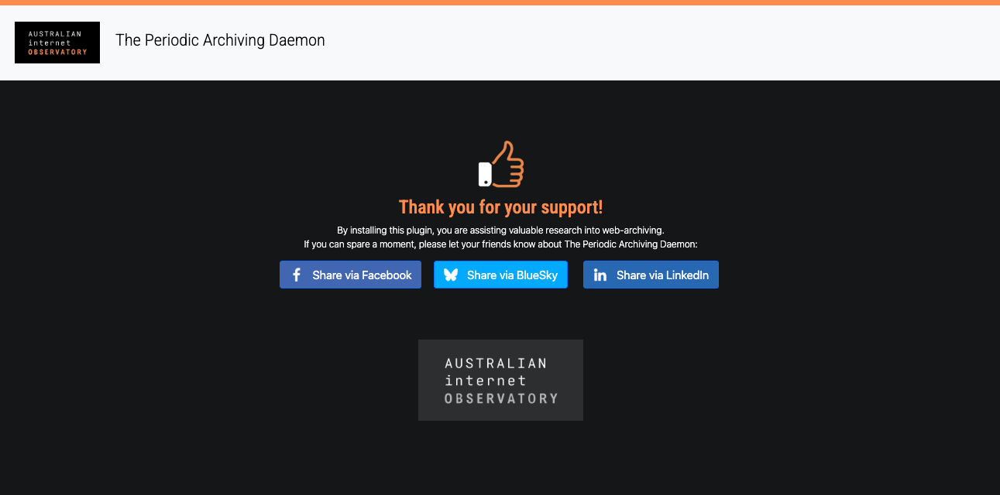

This design is configurable by the following strings:

`config.json → strings → share.html → SHARE_HEADING`<br>
_The heading of the share page._

`config.json → strings → share.html → SHARE_LEAD`<br>
_The blurb of the share page._

`config.json → strings → share.html → SHARE_PLUGIN_LOGO_FILE`<br>
_The 'share the plugin' imagery to show on the share page._

`config.json → strings → share.html → SHARE_FACEBOOK_URL`<br>
_The 'call-to-action' link for sharing the plugin to Facebook._

`config.json → strings → share.html → SHARE_LINKEDIN_URL`<br>
_The 'call-to-action' link for sharing the plugin to LinkedIn._

`config.json → strings → share.html → SHARE_BLUESKY_URL`<br>
_The 'call-to-action' link for sharing the plugin to BlueSky._

##### Countdown to Archiving Process

`https://github.com/Australian-Internet-Observatory/aio-periodic-archiving-daemon/blob/master/plugin/src/pages/countdown.html`

Intermittently the plugin will automatically spin up an archiving process. This will be prefaced by a countdown that the participant can then action if necessary. In some cases, the participant may wish to cancel or pause the process - for this, the plugin also provides options.

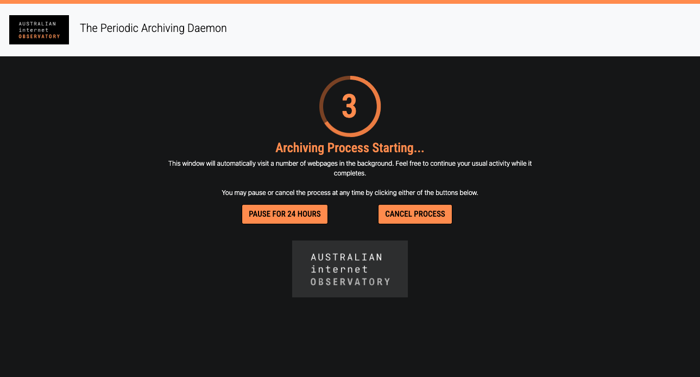

This design is configurable by the following strings:

`config.json → strings → countdown.html → COUNTDOWN_HEADING`<br>
_The heading of the countdown page._

`config.json → strings → countdown.html → COUNTDOWN_HEADING_ALT`<br>
_The heading of the countdown page also - however ending with an ellipsis._

`config.json → strings → countdown.html → COUNTDOWN_LEAD`<br>
_The blurb of the countdown page._

`config.json → strings → countdown.html → COUNTDOWN_PAUSED_MODAL_HEADING`<br>
_The heading of the modal that displays when the countdown page is paused._

`config.json → strings → countdown.html → COUNTDOWN_PAUSED_MODAL_TEXT`<br>
_The text of the modal that displays when the countdown page is paused._

`config.json → strings → countdown.html → BUTTON_PAUSE_FOR_24HRS_TEXT`<br>
_The text that displays on the button that pauses the archiving process, and by extension, the countdown._

`config.json → strings → countdown.html → BUTTON_CANCEL_PROCESS_TEXT`<br>
_The text that displays on the button that cancels the archiving process, and by extension, the countdown._

##### Archiving Process

`https://github.com/Australian-Internet-Observatory/aio-periodic-archiving-daemon/blob/master/plugin/src/pages/archiving_process.html`

When an archiving process begins, the plugin will display an out-of-focus window that enables the participant to go about their usual browser behaviour without being interrupted. In the out-of-focus window will be the 'archiving process' page, as well as various 'query' pages that are spun up by the archiving process.

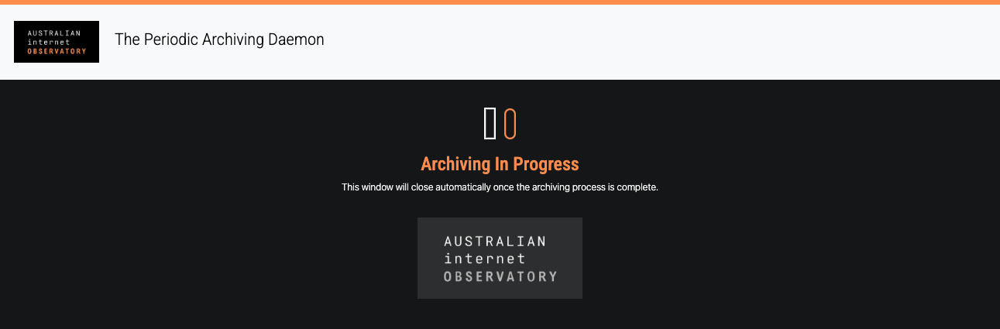

This design is configurable by the following strings:

`config.json → strings → archiving_process.html → ARCHIVING_PROCESS_HEADING`<br>
_The heading of the archiving page._

`config.json → strings → archiving_process.html → ARCHIVING_PROCESS_TEXT_LEAD`<br>
_The blurb of the archiving page._

##### The In-Browser Pop-Up

`https://github.com/Australian-Internet-Observatory/aio-periodic-archiving-daemon/blob/master/plugin/src/pages/popup.html`

At any stage during which the plugin is installed on the participant's browser, they will be able to access the pop-up by clicking a button in their browser bar. As indicated by the participant flow, this may direct them to register...

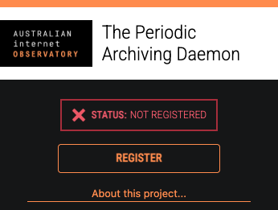

...enable them to perform various plugin functions...

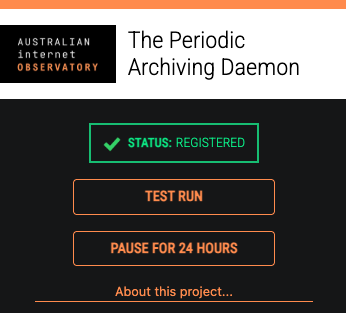

...or observe completion of the research project's data collection phase.

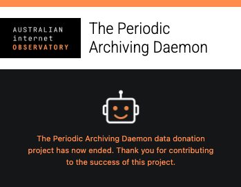

This design is configurable by the following strings:

`config.json → strings → popup.html → BUTTON_TEST_RUN_TEXT`<br>
_The text that displays on the button that indicates to 'test run' the plugin's archiving process._

`config.json → strings → popup.html → BUTTON_REGISTER_TEXT`<br>
_The text that displays on the button that indicates to register the plugin._

`config.json → strings → popup.html → BUTTON_PAUSE_FOR_24HRS_TEXT`<br>
_The text that displays on the button that indicates to pause the plugin for 24 hours._

`config.json → strings → popup.html → ABOUT_THIS_PROJECT_TEXT`<br>
_The text that displays on the link to learn more about the relevant research project._

`config.json → strings → popup.html → BUTTON_PAUSE_FOR_24HRS_RESUME_TEXT`<br>
_The text that displays on the button to resume the project for 24 hours._
    
`config.json → strings → popup.html → PLUGIN_STATUS_TEXT`<br>
_The text that displays to indicate the status of the plugin._
    
`config.json → strings → popup.html → PLUGIN_STATUS_REGISTERED_TEXT`<br>
_The text that displays to indicate that the plugin is registered._
    
`config.json → strings → popup.html → PLUGIN_STATUS_UNREGISTERED_TEXT`<br>
_The text that displays to indicate that the plugin is unregistered._
    
`config.json → strings → popup.html → PLUGIN_DATA_COLLECTION_WINDOW_ENDED_TEXT`<br>
_The text that displays to indicate that the plugin's data collection window has ended._
    
`config.json → strings → popup.html → PLUGIN_DATA_COLLECTION_WINDOW_ENDED_IMAGE`<br>
_The imagery that indicates that the data collection time window has ended._

### Constants

Beyond branding the plugin, there are also values that can be set in order to augment the general behaviour of the plugin - these are given as follows:

`config.json → constants → startDate`<br>
_The start date of the intended data collection (given as an ISO date/time string) - the plugin will not run before this date._

`config.json → constants → endDate`<br>
_The end date of the intended data collection (given as an ISO date/time string) - the plugin will not run after this date._

`config.json → constants → learnMorePage`<br>
_The link to the webpage where participants can learn more about the research project._

`config.json → constants → runInterval`<br>
_The number of minutes that will elapse between executions of the plugin._

`config.json → constants → searchProcessInterval`<br>
_The time (in milliseconds) that should elapse between individual archiving processes._

`config.json → constants → timeDelayMillisecondsBeforeStartingProcess`<br>
_The time (in milliseconds) that should elapse after the countdown completes, and before starting a new archiving process._

`config.json → constants → timeMillisecondsCheckTimerValue`<br>
_The time (in milliseconds) that should elapse before a new check is undertaken on the status of the archiving process._

`config.json → constants → maxTimesToRunPerDay`<br>
_The maximum number of times that an archiving process can run within a given day._

`config.json → constants → timeMillisecondsToWaitBeforeSendingBackScrapeFirstAttempt`<br>
_The time (in milliseconds) that should elapse before running the first attempt to retrieve a scrape on an archived query._

`config.json → constants → timeMillisecondsToWaitBeforeSendingBackScrapeSecondAttempt`<br>
_The time (in milliseconds) that should elapse before running the second attempt to retrieve a scrape on an archived query._

`config.json → constants → timeMillisecondsToWaitBeforeSendingBackScrapeThirdAttempt`<br>
_The time (in milliseconds) that should elapse before running the third attempt to retrieve a scrape on an archived query._

`config.json → constants → timeMillisecondsBeforeDeletingWindowFirstAttempt`<br>
_The time (in milliseconds) that should elapse before deleting an 'archiving process' window._

`config.json → constants → firefoxGeckoID`<br>
_For distributing the plugin to the Mozilla Firefox Add-Ons Store, a Gecko ID is provided by their online development console, and should be specified here. Learn more [here](https://extensionworkshop.com/documentation/develop/extensions-and-the-add-on-id/)._

### Building The Plugin

The plugin is designed such that its preparation for distribution can be achieved with only a few commands. As a prerequisite, you will need to have Node JS installed - then run the following command:

```bash
npm install
```

Afterwards, distribution to browsers that support Manifest Version 2 protocol (such as Mozilla Firefox or Opera) can be executed as follows:

```bash
npm run buildmv2
```

Similarly, distribution to browsers that support Manifest Version 3 protocol (such as Google Chrome or Microsoft Edge) can be executed as follows:

```bash
npm run buildmv3
```

In either case, this will create a 'dist' sub-directory in the working directory of the plugin. Therein, respective sub-directories can be compressed and exported to the relevant extension store, or loaded as unpacked extensions directly into a test browser.

## The Scrape Routine

In this section, various components of the Periodic Archiving Daemon's scrape routine are introduced to highlight the various capabilities of its functionality. These components form parametrics and useful behaviours to improve what gets captured during the Periodic Archiving Daemon's archiving process.

### Website Access Permissions

Before being able to visit web pages, the Periodic Archiving Daemon must first outline the patterns of the sites that it intends to visit. This can be achieved by editing the example patterns given in the following locations:

`config.json → manifest → common → content_scripts → matches`

`config.json → manifest → contextualised → permissions → 2`

***Note:** Only edit the patterns after the webRequestBlocking entry.*

`config.json → manifest → contextualised → host_permissions → 3`

These patterns follow the conventions outlined [here](https://developer.chrome.com/docs/extensions/develop/concepts/match-patterns) and must be specified in order for the plugin to work.

### Spoofing User Agents

A foundational component of the Periodic Archiving Daemon is the ability to spoof user agents, in order to control what kind of content is delivered by the websites that are visited. These user agents are distinguished by their user agent strings, and can be set at the following location:

`config.json → userAgentTypes`

***Note:** Any key within this object forms the name of a user agent that will be indexed by the scraper for the archiving process. The `user_agent` key for the sub-object of each key therein spoofs the identity of the browser to the website being visited.*

***Note:** A `desktop` key (with value `null`) is included by default - this key indexes the case of performing the archiving process without spoofing a user agent.*

***Note:** Not every user agent is spoofed in every archiving process. See the 'Query Enumeration' section for more details.*

### Defining URLs To Scrape

The Periodic Archiving Daemon is capable of scraping both hard-coded websites, and websites with injected queries. Pre-defined query terms can be listed at the following location:

`config.json → scraper → keywords`

During the archiving process, these keywords are encoded to support injection into a URL. Then, depending on the user agent that is being currently spoofed, relevant details are retrieved from the following location:

`config.json → scraper → selectors_<USER_AGENT_BEING_SPOOFED>`

At this location, you can define a list of objects, where each is an individual website URL that you wish to archive. The following fields can be set therein:

| Field      | Description                                                  |
| ---------- | ------------------------------------------------------------ |
| `platform` | A tag that you can apply to the URL to help sort or group it among other entries. |
| `url`      | The website URL to visit. For this value, the following two flags can optionally be set:<br /><br />**DYNAMIC_OPTIONS_KEYWORD** : This will be replaced with the relevant keyword that is currently being enumerated on the website's URL.<br />**DYNAMIC_NAVIGATOR_LANGUAGE** : This will be replaced with the navigator language, relative to the browser. |
| `items`    | For every key contained in this object, the scraper will attempt to retrieve a result defined by the value of the key. In the 'Scrape-Value Interpreter' section, this will be elaborated further. |

***Note:** If you are not interested in parameterizing the set of keywords over the user agent, you can simply set the `config.json → scraper → keywords` value to a list of one single empty string (i.e., `""`). Then, the website URLs to visit can be hard-coded again at `config.json → scraper → selectors_<USER_AGENT_BEING_SPOOFED>`, however without including the `DYNAMIC_OPTIONS_KEYWORD` flag therein.*

### Query Enumeration

The number of queries that the Periodic Archiving Daemon should make in a single archiving process are equivalent to the number of user agents that are spoofed, multiplied by the number of keywords, again multiplied by the number of website URLs indicated for the user agent. Hypothetically, this number grows large very quickly - to avoid overloading the browser with web requests, only one user agent is spoofed per archiving process.

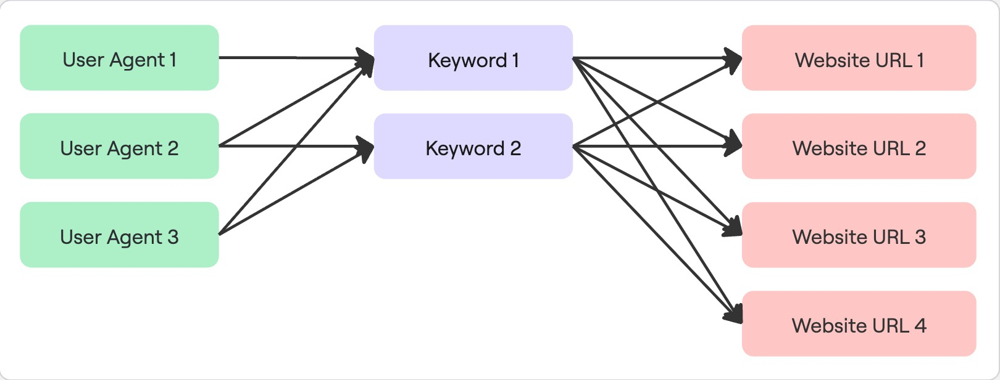

*A visualisation of all the different combinations of web pages that would need to be visited within a single archiving process - this amount is greatly decreased by only setting the process to one user agent in a single archiving process.*

### Scrape-Value Interpreter

#### Why Use An Interpreter?

In developing a research solution of this kind, a variety of usage contexts were considered.

Research projects whose participants have automated data collection implement ethics standards that limit the kinds of data that can be sent off participant devices. This mitigates risks associated with sending personal information across HTTP (the worst case scenario being the transmission of a participant's personal data). The Periodic Archiving Daemon (being no exception) was designed with this in mind. Only data relevant to the research project would be collected. This could hypothetically be achieved with a ReGeX script that isolates a relevant section of a webpage.

Although most of contemporary target websites were found to regularly update their UI design, and so the proposed ReGeX approach would need to be adjusted continuously. To compound to this, submitting updated versions of the plugin to research participants would be set back by review times of the relevant vendors (such as the Chrome Web Store, Mozilla Firefox Add-ons, etc.). This would disrupt scraper coverage, especially for studies where frequently updated data was required.

To overcome this, the ReGeX approach would need to be injected instantaneously - for this reason, the config.json file is designed to frequently update from the URL set at the following location:

`config.json → configURL`

However, even this added versatility would not be able to anticipate the complexity, or unknown forms in which data could be presented. Ideally, the software would benefit the usage of EcmaScript 'eval' usage, which would allow for direct injection of EcmaScript (the compiler language of the plugin) into the scraper functionality. However this line of functionality has been restricted by vendors for security reasons.

As a final alternative, it was determined that an interpreter would need to be designed in order to provide the added complexity required for the scraper functionality. This combined solution would allow for the scraper functionality to be updated instantaneously, integrate ReGeX, provide added complexity for unknown forms of data, and comply with vendor standards all at once.

#### Using The Interpreter

The interpreter is designed to execute a straightforward set of procedures, defined by an 'interpreter string' that you set.

An interpreter string is composed of three kinds of elements:

| Element         | Description                                                  |
| --------------- | ------------------------------------------------------------ |
| **Pre-Strings** | Pre-strings are deliberate hard-coded texts that are prepended to the value, and are encased in parenthesis of form `-{` and `}-`.<br />e.g. `-{http://www.website.com/?q=}-` |
| **Flags**       | Flags signal instructions to execute a process or transformation on the value, and are encased in parenthesis of form `[` and `]`.<br />e.g. `[FLAG_UNESCAPE]` unescapes the result. |
| **ReGeX**       | ReGeX can be used to isolate one or more results from the value, and does not require parenthesis.<br />e.g. `(?<=foo).*?(?=bar)` yields everything between the texts `foo` and `bar` in the result. |

These elements can be implemented infinitely many times, and carry forward their results to one another - as the Scrape-Value Interpreter evaluates the prescribed elements from *right-to-left*, instructions given by each of the elements are then also implemented on the result (or results) from right to left. The initial value on which the elements' instructions are carried out is the raw HTML of the page. Thus, an interpreter string of `^.*$` would yield the entire HTML of the scraped page. Whereas, an interpreter string of 
<br>
`-{http://www.website.com/?q=}-[FLAG_UNESCAPE](?<=foo).*?(?=bar)`
<br>
would yield the result `http://www.website.com/?q=hello` if the raw HTML of the scraped page were `foo\u0068\u0065\u006c\u006c\u006fbar`.

Furthermore, when specifying interpreter strings (as indicated in earlier sections), a list of interpreter strings are specified for a single key - if the first interpreter string returns a null value, the second is executed, and so on. This works as a fallback mechanism to promote stability of scraped results.

The full reference of all flags used by the Scrape-Value Interpreter are given in the next section.

#### Flag Reference

| Flag                       | Description                                                  |
| -------------------------- | ------------------------------------------------------------ |
| `FLAG_DESLASH`             | Removes all slashes from the result.                         |
| `FLAG_YOUTUBE_URL_CLEAN`   | A convention of pages scraped from YouTube is that results may sometimes have preceding `//` characters, obscuring certain URLs - the flag removes said characters from the result. |
| `FLAG_STRIP_HTML`          | This flag strips the result of all HTML tags.                |
| `FLAG_UNESCAPE`            | This flag applies complete Unicode character escaping to the result. |
| `DYNAMIC_HTML`             | Strip all HTML tags of their attributes, but keep the tag names in order to preserve the structure of the scraped content (useful for cases where a schema can't be determined for the data being scraped). |
| `FLAG_NULL`                | This flag signals to the interpreter to yield a null value (useful for stubbing). |
| `FLAG_NUMBER`              | This flag converts the result to a numerical value.          |
| `FLAG_FZVIEWS`             | This flag implements fuzzy logic to extract numbers from a result that might be formatted such as '1,000' or '10K views', |
| `FLAG_FZTIME`              | This flag implements fuzzy logic to extract time values from arbitrary formats, and converts them into Unix timestamps. Presently it handles cases such as '29.03.2020', '29/03/2020', 'Dec 21', 'X units ago', 'Yesterday', 'Feb 21 2020', and 'Streamed 1 day ago'. |
| `FLAG_FZDURATION`          | This flag converts colon-separated durations (e.g., 00:01:38) into seconds - also handles 'LIVE' value. |
| `FLAG_INDEXED`             | This flag returns a Boolean true value if the result is non-null. |
| `FLAG_LISTIFY_MATCHES`     | In standard cases, ReGeX patterns that return more than one match only retain the first match as the contemporary result for further instructions. This flag signals to the preceding ReGeX that all future instructions are to be executed on all matches of the pattern (i.e., retain all matches). |
| `FLAG_CONCATENATE_MATCHES` | In cases where (after running the FLAG_LISTIFY_MATCHES flag) it may be desired to concatenate the result into a single value, this flag concatenates the result as a string. |
| `FLAG_RECURSE`             | This flag indicates that the preceding ReGeX is required to run recursively on the return matches until it yields no more results. |

## Data Collection

### Overview

Beyond the plugin, the process of data collection is facilitated by resources that will need to reside on a cloud server solution. While this may vary from project to project, we provide source code for direct integration into Amazon Web Services (AWS). These resources are specified here.

### Data Collection Function

***Note:** As a prerequisite to this section, you will need to have:*

* Python 3.12+
* [AWS CLI](https://aws.amazon.com/cli/) installed and configured to your relevant account 
* [Docker](https://www.docker.com/)

The data collection function is the first of the cloud solutions; it is responsible for offering API endpoints (facilitated by API GateWay) to which participants can send data donations and demographic data. Provided that the data is well-formed, it then routes it to relevant S3 buckets, where it is processed further if necessary.

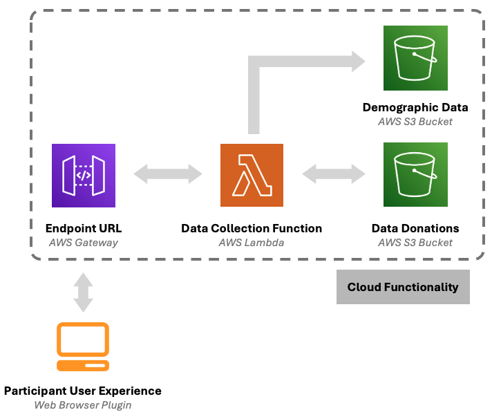

#### Demographic Data

As was previously elaborated in the Registration Form section, demographic details submitted in the registration process can be changed to suit your own data collection requirements. It is however necessary that you anticipate these fields within the Lambda function itself, which will require you to set specifications before deploying the Lambda function. Consider the following payload object that corresponds to the template demographic data that is collected:

```json
{
  "uuid" : "NEW_PARTICIPANT_UUID_HERE",
  "version" : "PLUGIN_VERSION_HERE",
  {
    "age" : 99,
    "gender" : "GENDER_HERE",
    "postcode" : "POSTCODE_HERE",
    "political_preference" : "POLITICAL_PREFERENCE_HERE",
    "income_bracket" : "INCOME_BRACKET_HERE",
    "education_level" : "EDUCATION_LEVEL_HERE",
  },
  "created_at" : 999999999999 // Unix timestamp
}
```

***Note:** The 'created_at' field is generated by the Lambda function, and added to the payload dynamically.*

To anticipate a payload such as this, edit the file [here](https://github.com/Australian-Internet-Observatory/aio-periodic-archiving-daemon/blob/master/backend/data_collection_lambda/config.json). Therein the path `demographic_details → mappings` provide the key paths to each demographic characteristic that will be anticipated, as well as the formal names for these characteristics when compiling a spreadsheet of data. The path for the ordering of the columns to be fed into the spreadsheet is given at `demographic_details → orderings`. Furthermore, the name of the bucket to which demographic details for newly registering participants is given at `s3_demographic_data_bucket`.

##### Local Reporting & Debugging

While AWS provides a user interface for reviewing the behaviour of the Lambda function, functionality is also provided for running events locally on your machine. This can be done within a Python 3.12+ virtual environment (ideally entitled `env-local`) - run the following command from within the environment to install all necessary requirements:

```bash
pip install -r requirements-local.txt
```

Then run the following command to simulate a registration process:

```bash
python lambda_function.py register_simulation
```

This will simulate the creation of a new participant, and output their details to the terminal.

Alternatively, run the following command for reporting the demographic characteristics of all participants:

```bash
python lambda_function.py report
```

This will generate a presigned URL that can be visited to download an Excel spreadsheet with all necessary participant details.

##### Continuous Deployment

To push changes to your codebase from your local machine to your Lambda function, you will need to adjust the bash script [here](https://github.com/Australian-Internet-Observatory/aio-periodic-archiving-daemon/blob/master/backend/data_collection_lambda/lambda.sh). It is noted that this script is configured to run on Linux, and may differ in how it is formatted for Windows machines. Fundamentally, there are three values that will need to be edited:

| Value         | Description                                                  |
| ------------- | ------------------------------------------------------------ |
| `AWS_PROFILE` | Set this to your own AWS Profile *(see line 3)*              |
| `AWS_REGION`  | Set this to your own AWS Region *(see line 4)*               |
| `ARN`         | Set this to your own Lambda function's ARN, while preserving the command in which it is executing the update of AWS Lambda function code *(see line 22)* |

Then as like the previous section, create a new Python 3.12+ virtual environment (ideally entitled `env`) and run the following command from within the environment to install all necessary requirements:

```bah
pip install -r requirements-lambda.txt
```

Finally, push the changes to AWS by running the `lambda.sh` script.

```bash
chmod 777 lambda.sh # Some devices require permissions to run scripts of this kind
./lambda.sh
```

#### Data Donations

Data donations are facilitated by a perpetually operational Docker container that is routinely spun up by an EventBridge. The container processes incoming data donations, injecting them into a PostGreSQL RDS solution that can be accessed on a local machine through an EC2 'jump-box':

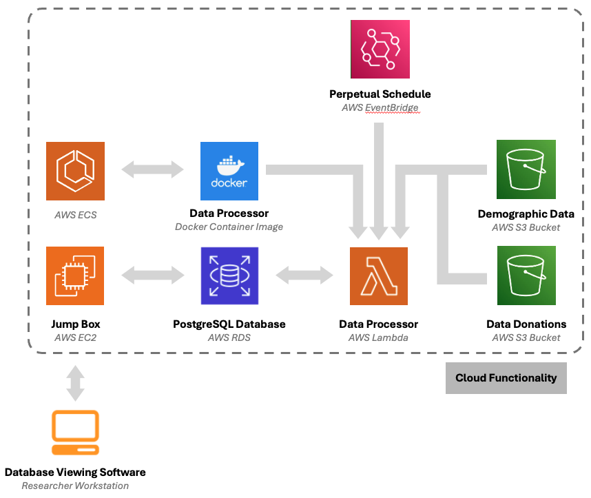

For more details on this specification, read the sub-guide [here](https://github.com/Australian-Internet-Observatory/aio-periodic-archiving-daemon/tree/master/backend/process_s3_objects).